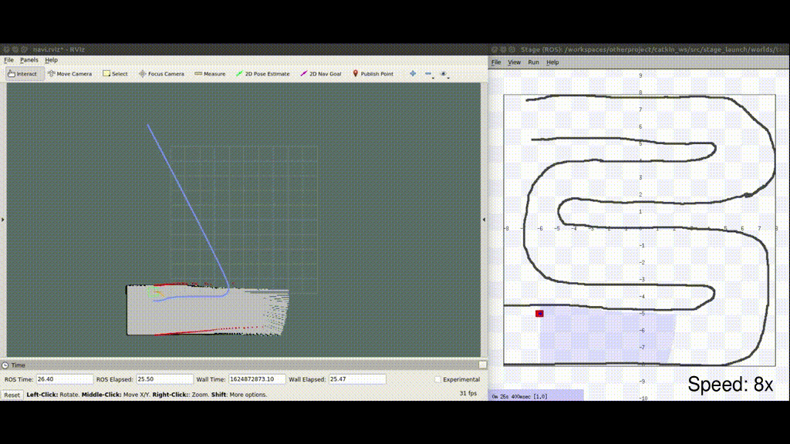

# MazeRunnerROS

В данной программе мобильный робот проходит простой лабиринт. Для моделирования поведения робота используется симулятор stage. Робот проходит лабиринт, используя навигацию move_base. По ходу своего движения он отстраивает карту местности, которая отображается в RViz.  




### Зависимости
Помимо ROS должны быть установлены пакеты:
* gmapping;
* stage_ros.

Их можно установить следующими командами.
* stage_ros:  
```bash
sudo apt-get install ros-$ROS_DISTRO-stage-ros	
```  

* gmapping
```bash
sudo apt-get install ros-$ROS_DISTRO-openslam-gmapping
```
```bash
git clone https://github.com/ros-perception/slam_gmapping src/slam_gmapping
```  

### Запуск
Для запуска проекта необходимо выполнить:
```bash
  roslaunch racing racing.launch
```  
